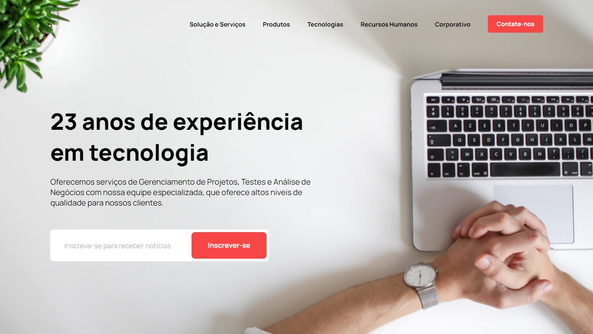

## Landing Page

Uma landing page responsiva.

Design criado por [Can Çevik](https://www.instagram.com/cevik.pdf/) e a aplicação desenvolvida por mim. Você pode acessar o site através [deste link](https://landing-page-6285b0.netlify.app/).

[](https://github.com/lucaslousada)
[](#)
[](#)
[](#)
[](LICENSE.md)

<div>
  
</div>
<p align="center">
  Você pode visualizar o layout do projeto através <a href="https://www.figma.com/community/file/992410574427069906/Responsive-Web-Page-%F0%9F%8E%89">deste link<a>.
</p>

## Tecnologias

Esse projeto foi desenvolvido com as seguintes tecnologias:

- ReactJS
- TypeScript
- Vite
- SASS e CSS Modules
- Eslint e Prettier

## Executar o projeto

Você precisa instalar o [Git](https://git-scm.com/downloads) e o [Node.js](https://nodejs.org/en/download/) para executar este projeto.
Você pode usar [Yarn](https://yarnpkg.com/) ou [Npm](https://nodejs.org/en/download/).

```bash
# Clone o projeto e acesse a pasta
$ git clone https://github.com/lucaslousada/landing-page.git && cd landing-page
# Instale as dependências
$ yarn
# Inicie a aplicação
$ yarn dev
```

Aplicação: http://localhost:3000

## Licença

Este projeto está licenciado sob a Licença MIT - veja o arquivo [LICENSE](LICENSE.md) para mais detalhes.

## Créditos

Siga o autor original: [Can Çevik](https://www.instagram.com/cevik.pdf/)
